# Object Diagram - AI Agent Governance System

## Overview
This object diagram represents a **runtime snapshot** of the AI Agent Governance system, showing specific instances of objects and their relationships at a particular moment in time (March 1, 2026, 10:35 AM).

## Diagram

```mermaid
graph TB
    subgraph "System Snapshot - Runtime Instance"
        subgraph Users
            user1["<u>admin_user: User</u><br/>id: usr-001<br/>username: admin<br/>role: ADMIN<br/>is_active: true"]
            user2["<u>engineer1: User</u><br/>id: usr-002<br/>username: engineer<br/>role: ENGINEER<br/>is_active: true"]
        end

        subgraph "AI Agents"
            agent1["<u>codeGen: Agent</u><br/>id: agt-101<br/>name: CodeBot-Alpha<br/>type: CODE_GENERATOR<br/>status: ACTIVE<br/>is_trusted: true<br/>owner: engineer1"]
            agent2["<u>reviewBot: Agent</u><br/>id: agt-102<br/>name: ReviewBot-Beta<br/>type: CODE_REVIEWER<br/>status: ACTIVE<br/>is_trusted: true<br/>owner: admin_user"]
            agent3["<u>testRunner: Agent</u><br/>id: agt-103<br/>name: TestBot-Gamma<br/>type: TEST_RUNNER<br/>status: SUSPENDED<br/>is_trusted: false<br/>owner: engineer1"]
        end

        subgraph "Governance Rules"
            rule1["<u>highRiskRule: GovernanceRule</u><br/>id: rule-201<br/>name: Block High-Risk Deployments<br/>type: RISK_THRESHOLD<br/>action: BLOCK<br/>severity: CRITICAL<br/>is_active: true<br/>priority: 10"]
            rule2["<u>timeLimit: GovernanceRule</u><br/>id: rule-202<br/>name: Task Execution Time Limit<br/>type: EXECUTION_TIME_LIMIT<br/>action: FLAG<br/>severity: MEDIUM<br/>is_active: true<br/>priority: 5"]
            rule3["<u>dataAccess: GovernanceRule</u><br/>id: rule-203<br/>name: Sensitive Data Protection<br/>type: DATA_SENSITIVITY<br/>action: REQUIRE_APPROVAL<br/>severity: HIGH<br/>is_active: true<br/>priority: 8"]
        end

        subgraph "Tasks"
            task1["<u>task1: Task</u><br/>id: tsk-301<br/>title: Generate Login API<br/>type: CODE_GENERATION<br/>status: COMPLETED<br/>risk_level: LOW<br/>assigned_to: codeGen<br/>created_by: engineer1"]
            task2["<u>task2: Task</u><br/>id: tsk-302<br/>title: Review Payment Module<br/>type: CODE_REVIEW<br/>status: RUNNING<br/>risk_level: HIGH<br/>assigned_to: reviewBot<br/>created_by: engineer1"]
            task3["<u>task3: Task</u><br/>id: tsk-303<br/>title: Deploy to Production<br/>type: DEPLOYMENT<br/>status: BLOCKED<br/>risk_level: CRITICAL<br/>assigned_to: null<br/>created_by: engineer1"]
            task4["<u>task4: Task</u><br/>id: tsk-304<br/>title: Run Unit Tests<br/>type: TESTING<br/>status: PENDING<br/>risk_level: LOW<br/>assigned_to: testRunner<br/>created_by: admin_user"]
        end

        subgraph "Audit Logs"
            log1["<u>log1: AuditLog</u><br/>id: log-401<br/>action: TASK_COMPLETED<br/>actor_type: AGENT<br/>actor_id: agt-101<br/>timestamp: 2026-03-01 10:30:00<br/>details: Task 301 completed"]
            log2["<u>log2: AuditLog</u><br/>id: log-402<br/>action: TASK_BLOCKED<br/>actor_type: SYSTEM<br/>actor_id: governance_engine<br/>timestamp: 2026-03-01 10:35:00<br/>details: Task 303 blocked by rule 201"]
            log3["<u>log3: AuditLog</u><br/>id: log-403<br/>action: RULE_TRIGGERED<br/>actor_type: SYSTEM<br/>actor_id: governance_engine<br/>timestamp: 2026-03-01 10:35:01<br/>details: Rule 201 triggered for task 303"]
            log4["<u>log4: AuditLog</u><br/>id: log-404<br/>action: AGENT_SUSPENDED<br/>actor_type: USER<br/>actor_id: usr-001<br/>timestamp: 2026-03-01 09:15:00<br/>details: Agent 103 suspended"]
        end

        subgraph "Anomaly Detection"
            anomaly1["<u>detection1: AnomalyDetection</u><br/>id: anom-501<br/>agent_id: agt-103<br/>anomaly_score: 0.87<br/>is_anomalous: true<br/>detected_at: 2026-03-01 09:14:00"]
        end
    end

    %% Relationships
    user2 -->|created| task1
    user2 -->|created| task2
    user2 -->|created| task3
    user1 -->|created| task4
    
    agent1 -->|executing| task1
    agent2 -->|executing| task2
    agent3 -->|assigned to| task4
    
    rule1 -->|blocked| task3
    rule2 -->|monitoring| task2
    rule3 -->|evaluating| task2
    
    task1 -->|generated| log1
    task3 -->|generated| log2
    rule1 -->|generated| log3
    user1 -->|performed action| log4
    
    agent3 -->|triggered| anomaly1
    anomaly1 -->|caused| log4

    classDef userClass fill:#e1f5ff,stroke:#01579b,stroke-width:2px
    classDef agentClass fill:#fff9c4,stroke:#f57f17,stroke-width:2px
    classDef taskClass fill:#f3e5f5,stroke:#4a148c,stroke-width:2px
    classDef ruleClass fill:#e8f5e9,stroke:#1b5e20,stroke-width:2px
    classDef logClass fill:#fff3e0,stroke:#e65100,stroke-width:2px
    classDef anomalyClass fill:#ffebee,stroke:#b71c1c,stroke-width:2px
    
    class user1,user2 userClass
    class agent1,agent2,agent3 agentClass
    class task1,task2,task3,task4 taskClass
    class rule1,rule2,rule3 ruleClass
    class log1,log2,log3,log4 logClass
    class anomaly1 anomalyClass
```

## Object Instances

### 1. **Users**
- **admin_user** (usr-001): Administrator with full system access
- **engineer1** (usr-002): Engineering role user who creates and manages tasks

### 2. **AI Agents**
- **codeGen** (agt-101): Active code generator agent owned by engineer1, currently executing task1
- **reviewBot** (agt-102): Active code reviewer agent owned by admin, executing task2
- **testRunner** (agt-103): Suspended test runner agent that triggered an anomaly

### 3. **Governance Rules**
- **highRiskRule** (rule-201): Critical severity rule that blocks high-risk deployments
- **timeLimit** (rule-202): Medium severity rule that flags tasks exceeding time limits
- **dataAccess** (rule-203): High severity rule requiring approval for sensitive data access

### 4. **Tasks**
- **task1** (tsk-301): ✅ COMPLETED - Low-risk code generation task
- **task2** (tsk-302): 🔄 RUNNING - High-risk code review task being monitored by multiple rules
- **task3** (tsk-303): 🚫 BLOCKED - Critical-risk deployment blocked by governance rule
- **task4** (tsk-304): ⏳ PENDING - Low-risk testing task waiting to be executed

### 5. **Audit Logs**
- **log1** (log-401): Records completion of task1 by codeGen agent
- **log2** (log-402): Records blocking of task3 by governance system
- **log3** (log-403): Records triggering of highRiskRule for task3
- **log4** (log-404): Records suspension of testRunner agent by admin

### 6. **Anomaly Detection**
- **detection1** (anom-501): Detected anomalous behavior in testRunner agent (score: 0.87)

## Key Relationships Demonstrated

### User → Task
- engineer1 created tasks 1, 2, and 3
- admin_user created task 4

### Agent → Task
- codeGen is executing task1 (completed)
- reviewBot is executing task2 (running)
- testRunner is assigned to task4 (pending, agent suspended)

### Rule → Task
- highRiskRule blocked task3 (critical risk deployment)
- timeLimit and dataAccess rules are monitoring task2

### Objects → Audit Logs
- All significant actions generate audit log entries
- Logs provide traceability and compliance records

### Anomaly → Agent Action
- Anomaly detection identified suspicious behavior in testRunner
- Led to admin suspending the agent

## Scenario Narrative

**Timeline of Events (March 1, 2026):**

1. **09:14 AM** - Anomaly detection system identifies unusual behavior in testRunner agent
2. **09:15 AM** - Admin user suspends testRunner agent as a precaution
3. **10:30 AM** - CodeGen agent successfully completes Login API generation task
4. **10:35 AM** - Engineer attempts to deploy to production, but governance rule blocks it due to critical risk level
5. **Currently** - ReviewBot is actively reviewing payment module code while being monitored by governance rules

## Object Diagram vs Class Diagram

| Aspect | Object Diagram | Class Diagram |
|--------|---------------|---------------|
| **Shows** | Specific instances | Abstract structure |
| **Names** | Underlined instance names | Class names |
| **Values** | Actual data values | Data types |
| **Time** | Snapshot at specific moment | Timeless blueprint |
| **Example** | `codeGen: Agent` with id=agt-101 | `Agent` class definition |

## Usage in System Documentation

This object diagram is useful for:

1. **Understanding Runtime Behavior**: Shows how objects interact during actual operation
2. **Debugging**: Visualizes specific scenarios for troubleshooting
3. **Testing**: Provides test case scenarios with concrete data
4. **Training**: Helps new team members understand system behavior with real examples
5. **Documentation**: Illustrates governance workflows and enforcement patterns

## Color Coding

- 🔵 **Blue**: Users (system actors)
- 🟡 **Yellow**: AI Agents (autonomous actors)
- 🟣 **Purple**: Tasks (work items)
- 🟢 **Green**: Governance Rules (policies)
- 🟠 **Orange**: Audit Logs (historical records)
- 🔴 **Red**: Anomaly Detection (security alerts)

---

**File Location**: `02_System_Design/diagrams/object_diagram.mmd`
**Related Diagrams**: [Use Case Diagrams](../USE_CASE_DIAGRAMS.md)
**Last Updated**: March 1, 2026
