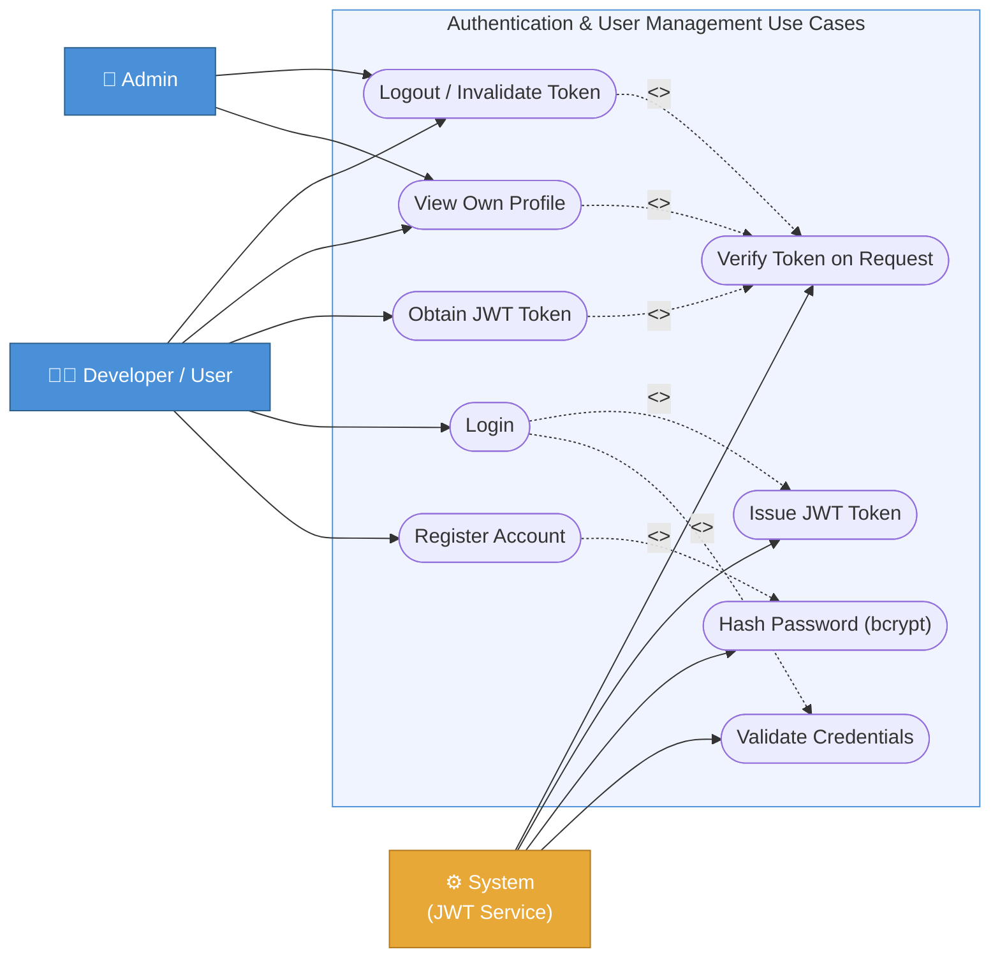
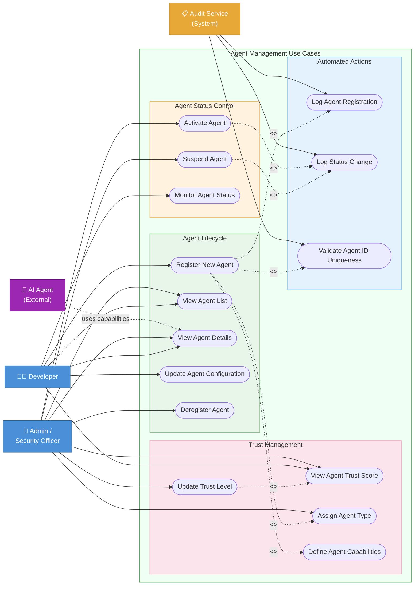
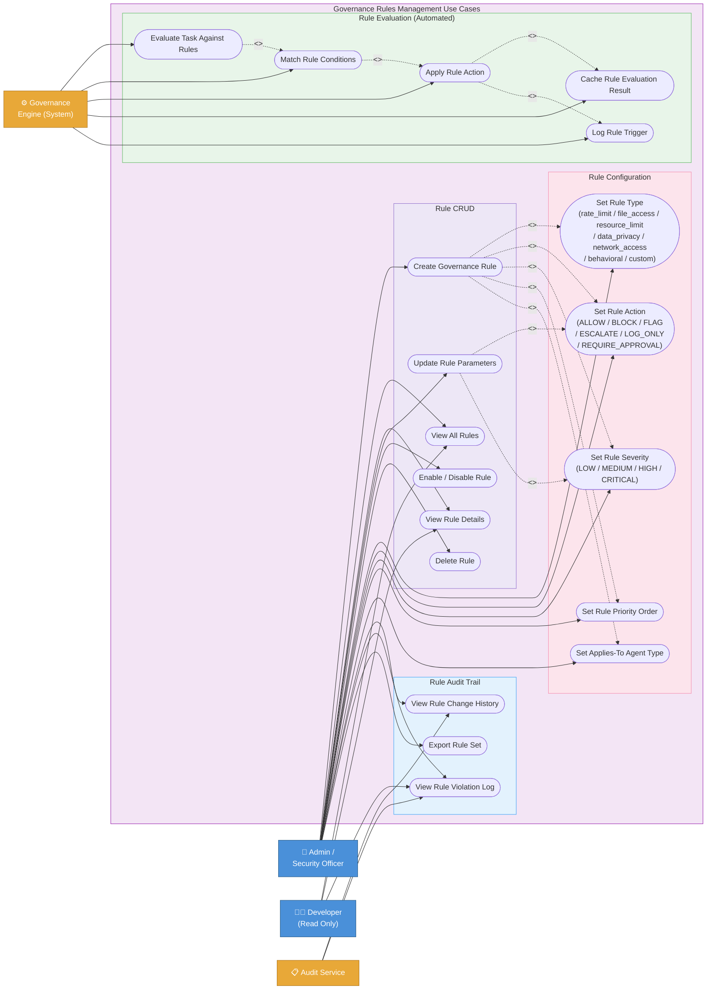
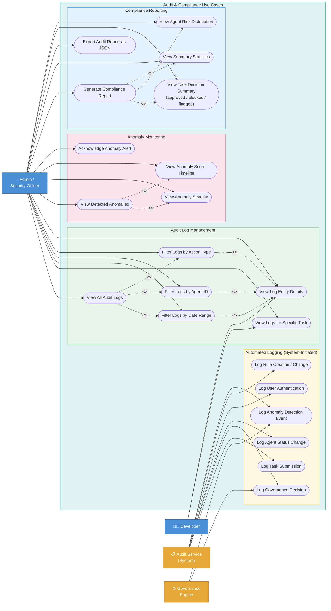
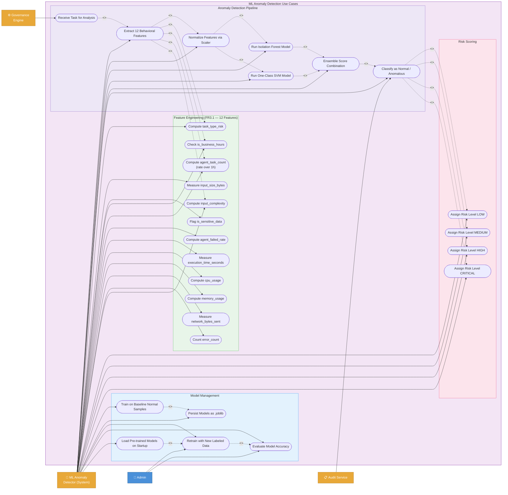

# Use Case Diagrams
## AI Agent Governance and Task Auditing System

**Document Type:** Functional Requirements — UML Use Case Diagrams  
**Version:** 1.0  
**Author:** Rivan Shetty | PRN: 12411956 | CS-K GRP 3 | Roll 13  
**Mapped SRS Sections:** FR1–FR4, NFR1–NFR3  

---

## Actors Reference

| Actor | Type | Role |
|-------|------|------|
| **Developer / User** | Human (Primary) | Registers agents, submits tasks, monitors own activities |
| **Admin / Security Officer** | Human (Primary) | Manages governance rules, reviews escalations, generates compliance reports |
| **Human Reviewer** | Human (Secondary) | Approves or rejects flagged tasks requiring manual review |
| **AI Agent** | External System | Executes tasks; interacts with the task execution API |
| **Governance Engine** | Internal System | Automatically evaluates all tasks against active rules and detectors |
| **ML Anomaly Detector** | Internal System | Runs Isolation Forest + One-Class SVM to score behavioral risk |
| **Audit Service** | Internal System | Logs all actions with full traceability |

---

## Relationship Legend

| Notation | Meaning |
|----------|---------|
| `──────►` | Actor **initiates** use case |
| `- - ->` `<<include>>` | Use case **always** invokes another |
| `- - ->` `<<extend>>` | Use case **optionally / conditionally** invokes another |

---

## UC-01: Overall System Use Case Diagram

High-level view mapping all 6 actors to all 8 use case subsystems (UC-A through UC-H).

```mermaid
graph TB
    subgraph Actors["👥 ACTORS"]
        DEV["🧑‍💻 Developer\n(User)"]
        ADMIN["🔐 Admin /\nSecurity Officer"]
        HUMAN_REV["👁️ Human Reviewer"]
        AI_AGENT["🤖 AI Agent\n(External System)"]
        GOV_ENGINE["⚙️ Governance Engine\n(System)"]
        ANOM_DET["🧠 ML Anomaly\nDetector (System)"]
    end

    subgraph AUTH["📋 UC-A: Authentication"]
        A1(["Register Account"])
        A2(["Login / Obtain JWT"])
        A3(["View Profile"])
        A4(["Logout"])
    end

    subgraph AGT["🤖 UC-B: Agent Management"]
        B1(["Register AI Agent"])
        B2(["View Agents"])
        B3(["Update Agent Config"])
        B4(["Suspend / Activate Agent"])
        B5(["Monitor Agent Trust Score"])
    end

    subgraph TASK["📝 UC-C: Task Management"]
        C1(["Submit Task"])
        C2(["Start Task Execution"])
        C3(["Complete / Fail Task"])
        C4(["Approve Flagged Task"])
        C5(["Reject Flagged Task"])
        C6(["View Task History"])
    end

    subgraph GOV["⚖️ UC-D: Governance Rules"]
        D1(["Create Governance Rule"])
        D2(["Update Rule"])
        D3(["Delete Rule"])
        D4(["Evaluate Task Against Rules"])
        D5(["View Active Rules"])
    end

    subgraph AUD["📊 UC-E: Audit & Compliance"]
        E1(["View Audit Logs"])
        E2(["Generate Compliance Report"])
        E3(["View Anomaly Alerts"])
        E4(["Filter Logs by Date / Type"])
    end

    subgraph DASH["📈 UC-F: Dashboard & Monitoring"]
        F1(["View System Statistics"])
        F2(["View Activity Feed"])
        F3(["View Risk Summary"])
    end

    subgraph ML["🧠 UC-G: ML Anomaly Detection"]
        G1(["Detect Task Anomaly"])
        G2(["Score Risk Level"])
        G3(["Retrain Baseline Models"])
        G4(["Extract Behavioral Features"])
    end

    subgraph ADV["🚨 UC-H: Advanced Governance"]
        H1(["Check Boundary Violations"])
        H2(["Check Goal Misalignment"])
        H3(["Check Tool Chaining Abuse"])
        H4(["Enforce Implicit Norms"])
        H5(["Prevent Runaway Behavior"])
        H6(["Enforce Security Boundaries"])
    end

    DEV --> A1 & A2 & A3 & A4
    DEV --> B1 & B2 & B3 & B4
    DEV --> C1 & C6
    DEV --> F1 & F2 & F3

    ADMIN --> D1 & D2 & D3 & D5
    ADMIN --> E1 & E2 & E3 & E4
    ADMIN --> B4 & B5
    ADMIN --> G3

    HUMAN_REV --> C4 & C5

    AI_AGENT --> C2 & C3

    GOV_ENGINE --> D4 & H1 & H2 & H3 & H4 & H5 & H6

    ANOM_DET --> G1 & G2 & G4

    classDef actor fill:#4a90d9,stroke:#2c5f8a,color:#fff,rx:5
    classDef system_actor fill:#e8a838,stroke:#b37a20,color:#fff,rx:5
    class DEV,ADMIN,HUMAN_REV actor
    class AI_AGENT,GOV_ENGINE,ANOM_DET system_actor
```

---

## UC-02: Authentication & User Management

Maps to **FR-AUTH**: User registration, JWT-based authentication, and session management.

---

## UC-03: Agent Management

Maps to **FR-AGENT**: Full lifecycle management of AI agents including registration, status control, and trust scoring.

---

## UC-04: Task Management & Governance Flow

Maps to **FR1 (Task Logging)**, **FR2 (Governance Engine)**, **FR3 (Anomaly Detection)**. This is the core governance pipeline.

```mermaid
graph TD
    DEV["🧑‍💻 Developer"]
    HUMAN_REV["👁️ Human Reviewer"]
    AI["🤖 AI Agent\n(External)"]
    GOV_ENG["⚙️ Governance\nEngine"]
    ANOM["🧠 Anomaly\nDetector"]
    AUD["📋 Audit Service"]

    subgraph TASK_UC["Task Management & Governance Use Cases"]

        subgraph SUBMIT["Task Submission"]
            C1(["Submit Task with Parameters"])
            C2(["Validate Task Input Schema"])
            C3(["Assign Task to Agent"])
        end

        subgraph EVAL["Governance Evaluation — Automated"]
            C4(["Evaluate Task Against Rules"])
            C5(["Score Task Risk Level"])
            C6(["Detect Behavioral Anomaly"])
            C7(["Apply Advanced Governance Checks"])
        end

        subgraph OUTCOME["Task Decision Outcome"]
            C8(["Allow Task Execution"])
            C9(["Block Task"])
            C10(["Flag Task for Review"])
            C11(["Escalate to Admin"])
            C12(["Require Human Approval"])
        end

        subgraph EXEC["Task Execution"]
            C13(["Start Task Execution"])
            C14(["Complete Task"])
            C15(["Fail Task"])
            C16(["Record Output & Metadata"])
        end

        subgraph REVIEW["Human Review"]
            C17(["View Flagged Task Details"])
            C18(["Approve Flagged Task"])
            C19(["Reject Flagged Task"])
            C20(["Add Review Note"])
        end

        subgraph HISTORY["Task History"]
            C21(["View Own Task History"])
            C22(["View Task Execution Logs"])
            C23(["View Task Decision Lineage"])
        end

        C1 -.->|"<<include>>"| C2
        C1 -.->|"<<include>>"| C3
        C1 -.->|"<<include>>"| C4
        C4 -.->|"<<include>>"| C5
        C4 -.->|"<<include>>"| C6
        C4 -.->|"<<include>>"| C7
        C4 -.->|"<<extend>>"| C8
        C4 -.->|"<<extend>>"| C9
        C4 -.->|"<<extend>>"| C10
        C4 -.->|"<<extend>>"| C11
        C10 -.->|"<<include>>"| C12
        C8 -.->|"<<include>>"| C13
        C13 -.->|"<<extend>>"| C14
        C13 -.->|"<<extend>>"| C15
        C14 -.->|"<<include>>"| C16
        C18 -.->|"<<include>>"| C13
        C19 -.->|"<<extend>>"| C9
    end

    DEV --> C1 & C21 & C22 & C23
    HUMAN_REV --> C17 & C18 & C19 & C20
    AI --> C13 & C14 & C15
    GOV_ENG --> C4 & C7 & C8 & C9 & C10 & C11
    ANOM --> C5 & C6
    AUD --> C16 & C22 & C23

    style TASK_UC fill:#fffde7,stroke:#f9a825
    style SUBMIT fill:#e8f5e9,stroke:#66bb6a
    style EVAL fill:#fce4ec,stroke:#f06292
    style OUTCOME fill:#f3e5f5,stroke:#ab47bc
    style EXEC fill:#e3f2fd,stroke:#42a5f5
    style REVIEW fill:#fff3e0,stroke:#ffa726
    style HISTORY fill:#e0f2f1,stroke:#26a69a

    classDef human fill:#4a90d9,stroke:#2c5f8a,color:#fff
    classDef system fill:#e8a838,stroke:#b37a20,color:#fff
    classDef external fill:#9c27b0,stroke:#6a0080,color:#fff
    class DEV,HUMAN_REV human
    class GOV_ENG,ANOM,AUD system
    class AI external
```

---

## UC-05: Governance Rules Management

Maps to **FR2 (Governance Rules Engine)**: Admin-controlled rule creation with 7 rule types, 6 actions, and 4 severity levels.

---

## UC-06: Audit & Compliance

Maps to **FR1.1–FR1.3** (logging), **FR4.1–FR4.4** (dashboard), **FR2.4** (rule change trail). 24 distinct `AuditAction` types tracked.

---

## UC-07: ML Anomaly Detection

Maps to **FR3.1–FR3.4**: Dual-model ML pipeline with 12 behavioral features, ensemble scoring, and model lifecycle management.

---

## UC-08: Advanced Governance — 6 Failure Mode Detectors

Maps to **FR2 (Extended)** and the `advanced_governance_rules.py` module. These use cases address what engineers actually encounter in production AI agent deployments — scenarios that simple allow/block rules cannot handle.

```mermaid
graph TD
    GOV_ENG["⚙️ Governance Engine\n(Orchestrator)"]
    ADMIN["🔐 Admin / Security Officer"]
    AUD["📋 Audit Service"]

    subgraph ADV_UC["Advanced Governance — 6 Failure Mode Detectors"]

        subgraph BV["1. BoundaryViolationDetector"]
            H1_1(["Check File System Access Scope"])
            H1_2(["Check Database Query Scope"])
            H1_3(["Check Network Endpoint Scope"])
            H1_4(["Check Memory Usage Threshold"])
            H1_5(["Detect Data Exfiltration Pattern"])
        end

        subgraph GM["2. GoalMisalignmentDetector"]
            H2_1(["Detect Reward Hacking Attempt"])
            H2_2(["Check Specification Gaming"])
            H2_3(["Detect Proxy Metric Exploitation"])
            H2_4(["Validate Output Aligns with Intent"])
            H2_5(["Check Distribution Shift"])
        end

        subgraph TC["3. ToolChainingGuardian"]
            H3_1(["Limit Tool Call Depth"])
            H3_2(["Check Tool Call Frequency"])
            H3_3(["Detect Recursive Tool Loops"])
            H3_4(["Monitor Cross-Tool Side Effects"])
            H3_5(["Enforce Tool Permission Scope"])
        end

        subgraph IN["4. ImplicitNormEnforcer"]
            H4_1(["Check Business Hours Enforcement"])
            H4_2(["Validate Change Management Workflow"])
            H4_3(["Enforce Code Review Process"])
            H4_4(["Check Notification Requirements"])
            H4_5(["Validate Rollback Plan Exists"])
        end

        subgraph RB["5. RunawayBehaviorPrevention"]
            H5_1(["Detect Runaway Loops"])
            H5_2(["Enforce Max Execution Duration"])
            H5_3(["Detect Exponential Resource Scaling"])
            H5_4(["Check Agent Self-Replication"])
            H5_5(["Monitor Task Spawn Rate"])
        end

        subgraph SB["6. SecurityBoundaryEnforcer"]
            H6_1(["Detect Prompt Injection Attempt"])
            H6_2(["Check Privilege Escalation Attempt"])
            H6_3(["Detect Credential Access Attempt"])
            H6_4(["Detect Lateral Movement Pattern"])
            H6_5(["Enforce Least Privilege Principle"])
        end

        subgraph OUTCOME2["Detection Outcomes"]
            H7(["Return BLOCKED + Reason"])
            H8(["Return FLAGGED + Warning"])
            H9(["Return PASS — No Violation"])
            H10(["Trigger Emergency Stop"])
        end

        H1_5 -.->|"<<extend>>"| H7
        H2_1 -.->|"<<extend>>"| H7
        H3_3 -.->|"<<extend>>"| H10
        H4_1 -.->|"<<extend>>"| H8
        H5_1 -.->|"<<extend>>"| H10
        H5_3 -.->|"<<extend>>"| H7
        H6_1 -.->|"<<extend>>"| H7
        H6_2 -.->|"<<extend>>"| H7
    end

    GOV_ENG --> H1_1 & H1_2 & H1_3 & H1_4 & H1_5
    GOV_ENG --> H2_1 & H2_2 & H2_3 & H2_4 & H2_5
    GOV_ENG --> H3_1 & H3_2 & H3_3 & H3_4 & H3_5
    GOV_ENG --> H4_1 & H4_2 & H4_3 & H4_4 & H4_5
    GOV_ENG --> H5_1 & H5_2 & H5_3 & H5_4 & H5_5
    GOV_ENG --> H6_1 & H6_2 & H6_3 & H6_4 & H6_5
    GOV_ENG --> H7 & H8 & H9 & H10
    ADMIN --> H7 & H8 & H10
    AUD --> H7 & H8 & H10

    style ADV_UC fill:#fff8e1,stroke:#f9a825
    style BV fill:#fce4ec,stroke:#e91e63
    style GM fill:#f3e5f5,stroke:#9c27b0
    style TC fill:#e8eaf6,stroke:#3f51b5
    style IN fill:#e8f5e9,stroke:#4caf50
    style RB fill:#fff3e0,stroke:#ff9800
    style SB fill:#ffebee,stroke:#f44336
    style OUTCOME2 fill:#e0f7fa,stroke:#00bcd4

    classDef human fill:#4a90d9,stroke:#2c5f8a,color:#fff
    classDef system fill:#e8a838,stroke:#b37a20,color:#fff
    class ADMIN human
    class GOV_ENG,AUD system
```

---

## Traceability Matrix: Use Cases → SRS Requirements

| Use Case Cluster | Use Cases | SRS FR | Source File |
|-----------------|-----------|--------|-------------|
| UC-A: Authentication | Register, Login, JWT, Logout | FR-AUTH | `api/auth.py`, `models/user.py` |
| UC-B: Agent Management | Register, Suspend, Trust Score | FR-AGENT | `api/agents.py`, `services/agent_service.py` |
| UC-C: Task Governance | Submit, Evaluate, Block/Flag/Approve | FR1.1, FR2.1–FR2.3 | `api/tasks.py`, `services/task_service.py` |
| UC-D: Governance Rules | CRUD Rules, 7 types, 6 actions | FR2.1–FR2.4 | `api/governance.py`, `services/governance_engine.py` |
| UC-E: Audit & Compliance | 24 Action Types, Reports, Filters | FR1.1–FR1.3, FR4.1–FR4.4 | `api/audit.py`, `services/audit_service.py` |
| UC-F: Dashboard | Stats, Activity Feed, Risk Summary | FR4.1–FR4.2 | `api/dashboard.py`, `static/index.html` |
| UC-G: ML Anomaly Detection | 12 Features, IsoForest + OC-SVM | FR3.1–FR3.4 | `services/anomaly_detector.py` |
| UC-H: Advanced Governance | 6 Failure Mode Detectors, 30 checks | FR2.1 (Extended) | `services/advanced_governance_rules.py` |

---

## Use Case Count Summary

| Cluster | Primary Use Cases | Include/Extend Relationships |
|---------|------------------|------------------------------|
| UC-A Authentication | 9 | 4 |
| UC-B Agent Management | 15 | 7 |
| UC-C Task Governance | 23 | 17 |
| UC-D Governance Rules | 19 | 8 |
| UC-E Audit & Compliance | 21 | 7 |
| UC-F Dashboard | 3 | — |
| UC-G ML Detection | 28 | 12 |
| UC-H Advanced Governance | 30 + 4 outcomes | 8 |
| **TOTAL** | **~148** | **~63** |

---

*Document generated for CS-K GRP 3 — AI Agent Governance and Task Auditing System*  
*Rivan Shetty | PRN: 12411956 | Roll 13*
